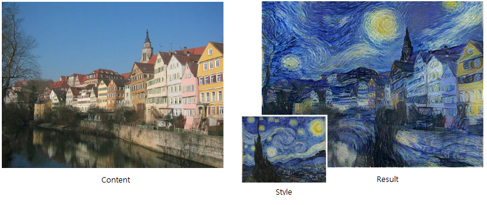
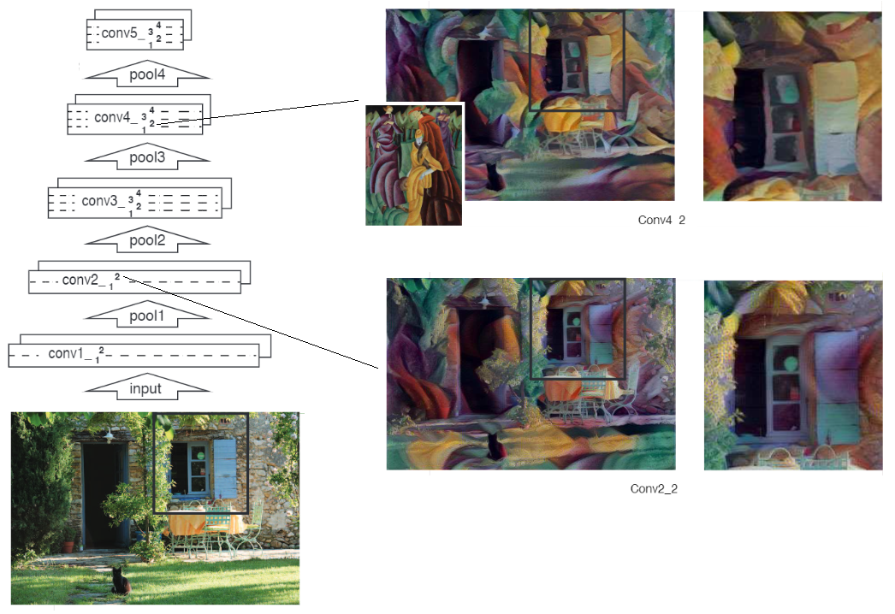
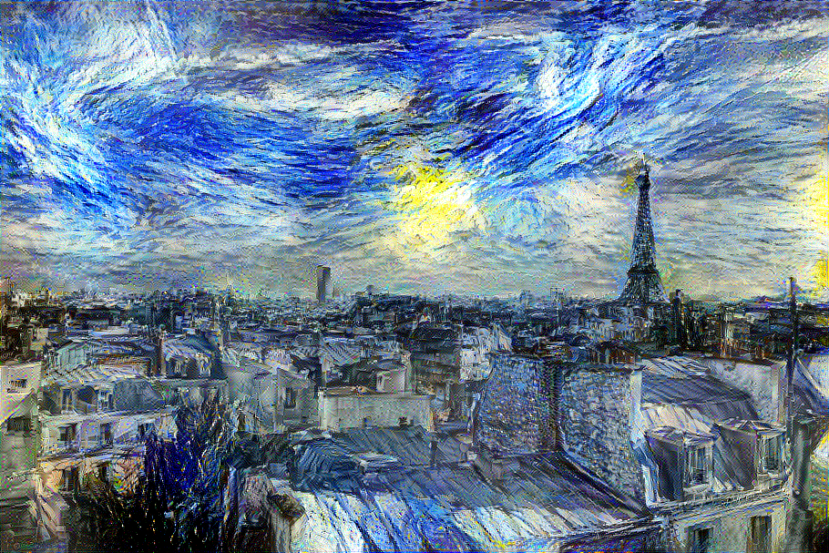

# Image Style Transfer Using Convolutional Neural Networks
A Keras Implementation of [Image Style Transfer Using Convolutional Neural Networks, Gatys et al.](https://www.cv-foundation.org/openaccess/content_cvpr_2016/papers/Gatys_Image_Style_Transfer_CVPR_2016_paper.pdf)  

The goal of this paper is to transfer styles from the source image while preserving the semantic content of the target image.

# Style Transfer
To transfer the style of (style image) onto (content image), we can define a loss function as follows:  

 is the generated image. α and β are the weighting factors for content and style reconstruction.  Lcontent is how similar  and  are in their content representation. Lstyle is how similar  and  are in their style representation.

In this paper, use CNN(VGG19) to generate images. Images can start from random image or content image. With each training, the resulting image is produced by updating the image with a smaller loss function. This is the method of updating the image directly, which has the disadvantage of taking a long time. This paper stated that it takes an hour to create a 512 x 512 image with an Nvidia K40 GPU.

# Lcontent
The activation value in a specific layer of the VGG19 network was defined as a **content representation**. And **content loss** can be expressed as the difference between the two image(content, generated) representations.  

Content loss is defined as the squared error loss between two feature representations as follows:  

Pl and Fl their respective feature representation in layer l.  

The image is updated so that both images have the same content representation value. As a deeper layer is used, specific pixel information is lost, and if a lower layer is used, a result similar to content can be obtained. Below is an example image created using the activation values of conv4_2 and conv_2_2.  

# Lstyle
In this paper, **Style representation** is defined as a correlation between different features. These feature correlations are given by the Gram matrix.

Style loss is defined as the squared error loss between two style representations as follows:  

and the total style loss is  

The image is updated so that both images have the same style representation. This is done by using gradient descent from a white noise image to minimise the mean-squared distance between the entries of the Gram matrices from the original image and the Gram matrices of the image to be generated.

# Result
- content image

- style image

- result (content_weight: 8e-4, style_weight=8e-1)

# Difference Between Paper and Implementation
- Use ADAM optimizer instead of L-BFGS
- Use maximum pooling average pooling(I couldn't find a way to easily replace the corresponding layer in keras)
